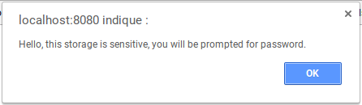
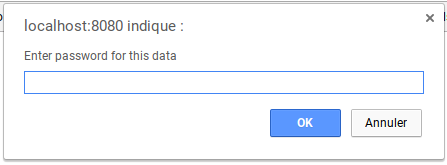
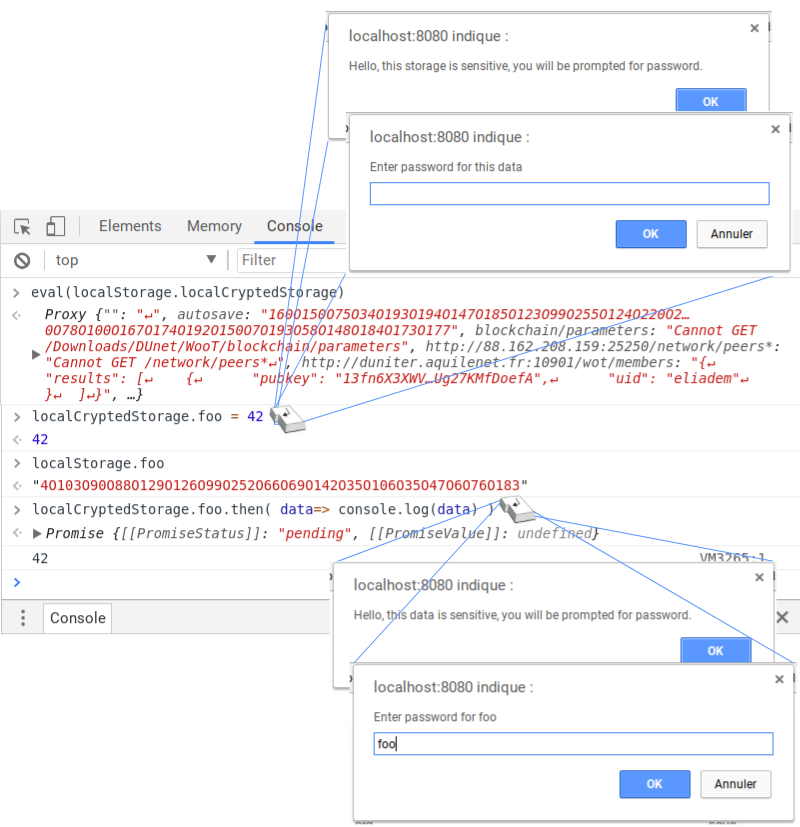
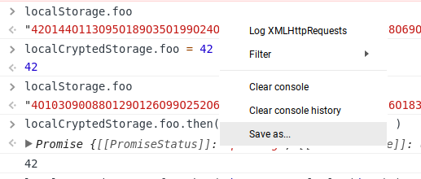
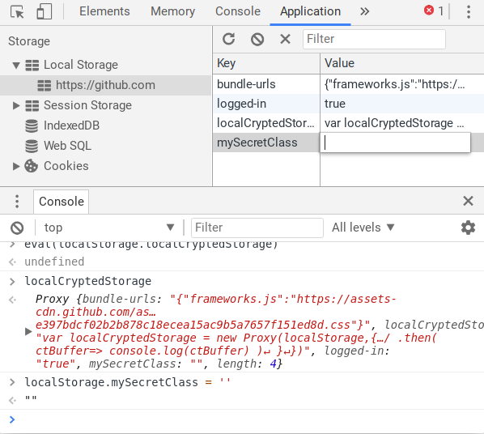

# localCryptedStorage
localStorage with crypto

## install in DevTools
Open your devtool console and paste the content of [](localCryptedStorage.js) , this:
```
localStorage.localCryptedStorage = `
var localCryptedStorage = new Proxy(localStorage,{
	
	get:function(o,p){
		// if( p == "algo" ) return {name: "AES-GCM", iv: Uint8Array.from([120,1,248,135,62,71,87,156,92,67,155,37])}
		if( p in o ){
			alert('Hello, this data is sensitive, you will be prompted for password.')
			let pass = prompt( "Enter password for "+p )
			const alg = {name: "AES-GCM", iv: Uint8Array.from([120,1,248,135,62,71,87,156,92,67,155,37])}
			return crypto.subtle.digest('SHA-256', new TextEncoder().encode(pass))
				.then( pwHash=> crypto.subtle.importKey('raw', pwHash, alg, false, ['decrypt']) )
				.then( key=> crypto.subtle.decrypt(alg, key, Uint8Array.from(o[p].split('O').map(Number)).buffer ) 	)
				.then( ptBuffer=> new TextDecoder().decode(ptBuffer) )
		}
	},
	set:function(o,p,v){
		alert('Hello, this storage is sensitive, you will be prompted for password.')
		let pass = prompt( "Enter password for this data" )
		const alg = {name: "AES-GCM", iv: Uint8Array.from([120,1,248,135,62,71,87,156,92,67,155,37])}
		return crypto.subtle.digest('SHA-256', new TextEncoder().encode(pass))
			.then( pwHash=> crypto.subtle.importKey('raw', pwHash, alg, false, ['encrypt']) )
			.then( key=> crypto.subtle.encrypt(alg, key, new TextEncoder().encode(v)) )
			.then( ctBuffer=> o[p] = new Uint8Array(ctBuffer).toString().replace(/,/g,'O') )
			// .then( ctBuffer=> console.log(ctBuffer) )
	}
})`

```

## use it
Then each time you need to write / read crypted storage, you need first to install the localCryptedStorage on the same domain:


```
eval( localStorage.localCryptedStorage )
```

And use it:

```
localCryptedStorage.foo = 42
```
You will be prompted to choose a password for this data (you change for each data or use the same, you see! ;) )
The fist alert is here to get the focus out of the devtool because `promp()` is blocked if not focus in the tab...





Using normal localStorage you can see the encrypted data:
```
> localStorage.foo
< "4O103O90O88O129O126O99O252O66O69O142O35O106O35O47O6O76O183"
```

Then retreieve the data with a promise, you will be prompted back for the password:
```
> localCryptedStorage.foo.then( data=> console.log(data) )
< Promise {[[PromiseStatus]]: "pending", [[PromiseValue]]: undefined}
< 42
```



If the password is not good the promise rejects:
```
localCryptedStorage.foo.then( data=> console.log(data) )
Promise {[[PromiseStatus]]: "pending", [[PromiseValue]]: undefined}
(index):1 Uncaught (in promise) DOMException
```

## write sensible data avoiding appearance in devtool's console history

You may not want to leave senssible data in you devtool's history



First create an empty var in `localStorage` where to put the data

```
localStorage.mySecretClass = ''
```

Go to the \[Application] tab in [ > Local Storage] and copy paste your class directly in the text field:



Then replace it with the crypted one (get prompted):
```
localCryptedStorage.mySecretClass = localStorage.mySecretClass
```

To use the secret class later:
```
localCryptedStorage.mySecretClass.then(eval)
//
new MySecretClass( ... )
```

## use case
Let's say I want to store my github's credentials to have a bookmarlet signing me up when I'm on github's login page.
_(bookmarklet not covered here)_
The bookmarklet uses localCryptedStorage installed in localStorage to get a `localCryptedStorage.credentials` object.


